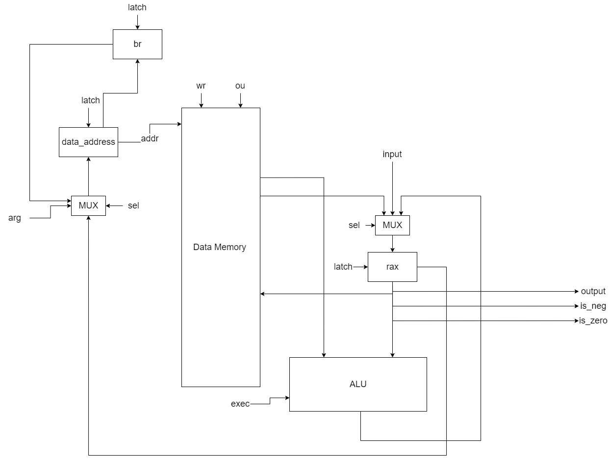
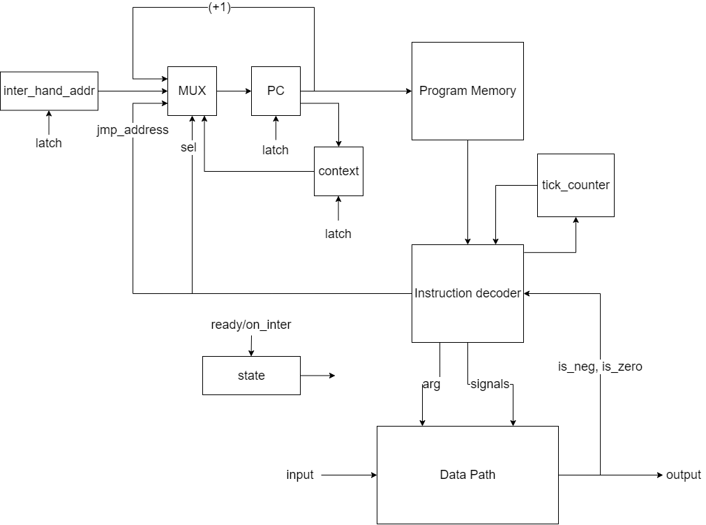

# Asm. Транслятор и модель

- Балтабаев Дамир P33121.
- `asm | risc | harv | hw | instr | struct | trap | port | prob2`

## Язык программирования

``` ebnf
program ::= term

term ::= section
       | label
       | command

section ::= "section ." section_name

section_name ::= "data" | "text"

label ::= "." name ":"

name ::= [a-z]

number ::= [-2^31; 2^31 - 1]

command ::=  op_two_args " " arg " " arg
           | op_one_arg " " arg
           | op_zero_args
 
op_two_args ::= "CMP" | "MOV" | "ADD" | "MOD"

op_one_arg ::= "JB" | "JNZ" | "JMP" | "PRINT" | "PRINT_CH#" | "JE" | "LD*" | "SV"

op_zero_args ::= "READ" | "HALT" | "PRINT_CH" | "INTER_END" | "INTER_START"

arg ::= name | number

```


Код выполняется последовательно. Операции:

- `CMP <arg1> <arg2>` -- отнять от первого аргумента второй
- `JB <label>` -- переход на метку если значение в аккумуляторе меньше нуля
- `MOV <arg1> <arg2>` -- скопировать значение из второго аргумента в первый
- `MOD <arg1> <arg2>` -- вычислить остаток от деления первого аргумента на второй
- `ADD <arg1> <arg2>` -- прибавить к первому аргументу второй
- `JNZ <label>` -- переход на метку если значение аккумулятора отлично от нуля
- `JMP <label>` -- переход на метку
- `READ` -- читает значение извне и сохраняет в памяти
- `HALT` -- завершение программы
- `PRINT_CH# <arg>` -- запись с косвенной постинкрементной адресацией: возьмет из памяти по адресу аргумента другой addr, по этому addr возьмет var, выведет var в буффер, после увеличив addr на единицу
- `SV <arg>` -- сохранит значение из аккумулятора в аргумент
- `LD* <arg>` -- загрузка в аккумулятор с косвенной относительной адресацией: возьмет из памяти по адресу аргумента другой addr, по этому addr возьмет var
- `JE <label>` -- переход, если аккумулятор равен нулю
- `PRINT_CH` -- запишет значение из памяти по нулевому адресу в буфер
- `INTER_END` -- конец цикла прерывания
- `INTER_START` -- начало цикла прерывания


## Организация памяти
Модель памяти процессора:

1. Память команд. Машинное слово -- не определено. Реализуется списком словарей, описывающих инструкции (одно слово -- одна ячейка).
2. Память данных. Машинное слово -- 32 бита, знаковое. Линейное адресное пространство. Реализуется списком чисел.

Строки, объявленные пользователем распеделяются по памяти один символ на ячейку.

```text
     Instruction memory
+-----------------------------+
| 00  : jmp i                 |
|    ...                      |
| i   : jmp 00                |
| i+1 : interruption handler  |
|    ...                      |
|  k  : inter_end             |
|    ...                      | 
+-----------------------------+

Data memory
+-----------------------------+
| 00  : data                  |
|    ...                      |   
|1024 : data                  |
+-----------------------------+
```

## Система команд

Особенности процессора:

- Машинное слово -- 32 бит, знаковое.
- `Память данных`:
    - адресуется через регистр `data_address`;
    - может быть записана:
        - с аккумулятора;
    - может быть прочитана:
        - в аккумулятор;
- `Аккумулятор`:
    - может читать из буффера ввода
    - может использоваться как флаг (zero/negative)
    - может читать из памяти
    - может быть подан на вывод
- Ввод-вывод -- порты ввода/вывода, по прерыванию
- `program_counter` -- счётчик команд:
    - инкрементируется после каждой инструкции или перезаписывается инструкцией перехода.
- `state` - флаг готовности:
    - 0 - если процессор уже обрабатывает прерывание, 1 - процессор готов к прерыванию
- `br` - буферный регистр для хранения адресов из регистра `data_address`
- `context` - регистр для хранения адресов возврата из счетчика команд
- `inter_hand_addr` - регистр для хранения адреса цикла прерывания программы


### Набор инструкций

|          Syntax       | Mnemonic          | Кол-во тактов | Comment  |
|:----------------------|:------------------|-------------- |:---------|
| `add <arg> <arg>`     | `add <arg> <arg>` | 6             | см. язык |                        
| `cmp <arg> <arg>`     | `cmp <arg> <arg>` | 5             | см. язык |         
| `mov <arg> <arg>`     | `mov <arg> <arg>` | 4             | см. язык |     
| `mod <arg> <arg>`     | `mod <arg> <arg>` | 5             | см. язык |     
| `jb <arg>`            | `jb <arg>`        | 1             | см. язык |     
| `jnz <arg>`           | `jnz <arg>`       | 1             | см. язык |    
| `jmp <arg>`           | `jmp <arg>`       | 1             | см. язык |    
| `print_ch# <arg>`     | `print_ch# <arg>` | 11            | см. язык |    
| `print <arg>`         | `print <arg>`     | 3             | см. язык |   
| `je <arg>`            | `je <arg>`        | 1             | см. язык |    
| `ld* <arg>`           | `ld* <arg>`       | 4             | см. язык |    
| `sv <arg>`            | `mov <arg> acc`   | 2             | см. язык |    
| `read`                | `mov data acc`    | 3             | см. язык |    
| `halt`                | `hlt`             | 0             | см. язык |    
| `print_ch`            | `mov out acc`     | 3             | см. язык |   
| `inter_end`           | `inter_end`       | 1             | см. язык |    
| `inter_start`         | `inter_start`     | 1             | см. язык |   


### Кодирование инструкций

- Машинный код сериализуется в список JSON.
- Один элемент списка, одна инструкция.
- Индекс списка -- адрес инструкции. Используется для команд перехода. Адрес также указан в поле "address"

Пример:

```json
[
   {
        "address": 0,
        "opcode": "CMP",
        "args": [
            4,
            2
        ]
    },
]
```

где:

- `opcode` -- строка с кодом операции;
- `args` -- адреса в памяти данных (могут отсутствовать);
- `address` -- адрес инструкции (индекс в списке)

Типы данные в модуле [isa](./isa.py), где:

- `Opcode` -- перечисление кодов операций;
- `SelectType` -- типы сигналов (селекты).
- `StateType` -- состояние процессора (прерывания).


## Транслятор

Интерфейс командной строки: `translator.py <input_file> <target_file> <data_file>"`

Реализовано в модуле: [translator](./translator.py)

Этапы трансляции (функция `translate`):

1. Проверка корректности программы (секции data/text, метки в text и т.д).
2. Выделение памяти для переменных/чисел в коде
3. Генерация машинного кода

Правила генерации машинного кода:

- один символ языка -- одна инструкция;
- для команд, однозначно соответствующих инструкциям -- прямое отображение;


## Модель процессора

Реализовано в модуле: [machine](./machine.py).

### DataPath



Реализован в классе `DataPath`.

Сигналы (обрабатываются за один такт, реализованы в виде методов класса):

- `wr` -- записать в data memory
- `ou` -- прочитать из data memory 
- `latch_data_address` -- защёлкнуть значение в `data_address`
- `latch_br` -- защёлкнуть значение в `br`
- `latch_acc` -- защёлкнуть значение в `acc`


Флаги:

- `is_zero` -- отражает наличие нулевого значения в аккумуляторе.
- `is_neg` -- отражает наличие отрицательного значения в аккумуляторе.


### АЛУ


Сигналы (обрабатываются за один такт, реализованы в виде методов класса):

- `sel_op` -- произвести операцию

### ControlUnit




Реализован в классе `ControlUnit`.

- Hardwired (реализовано полностью на python).
- Моделирование на уровне инструкций.
- Трансляция инструкции в последовательность (0-11 тактов) сигналов: `decode_and_execute_instruction`.

Сигнал:

- `latch_program_counter` -- сигнал для обновления счётчика команд в ControlUnit.
- `ready/on_inter` -- переключить тумблер state (либо 0, либо 1).
- `latch_context` -- сигнал для защёлкивания значения context.
- `latch_inter_hand_addr` -- сигнал для защёлкивания значения inter_hand_addr.

Особенности работы модели:

- Для журнала состояний процессора используется стандартный модуль logging.
- Количество инструкций для моделирования ограничено hardcoded константой.
- Остановка моделирования осуществляется при помощи исключений:
    - `StopIteration` -- если выполнена инструкция `halt`.
- Управление симуляцией реализовано в функции `simulate`.

## Апробация

В качестве тестов использовано пять алгоритмов:

1. [hello world](examples/hello_world).
2. [cat](examples/cat) -- программа `cat`, повторяем ввод на выводе.
3. [prob2](examples/prob2) -- программа решающая вторую проблему Эйлера.
4. [test1](examples/test1) -- посчитать сумму чисел от 1 до 15 не кратных 7.
5. [test2](examples/test2) -- посчитать разность между самым большим четным числом и самым большим нечетным в диапазоне от 1 до 15.

В качестве тестов для `translator` использовано 3 теста:
1. [cat](examples/correct_cat_opcodes) -- программа `cat`, повторяем ввод на выводе.
2. [prob2](examples/correct_prob2_opcodes) -- программа, решающая 2 проблему Эйлера.
3. [hello_world](examples/correct_hello_world_opcodes)

Интеграционные тесты реализованы тут: [machine_integration_test](./machine_integration_test.py) и [translator_integration_test](./translator_integration_test.py)

CI:

``` yaml
lab3-example:
  stage: test
  image:
    name: python-tools
    entrypoint: [""]
  script:
    - python3-coverage run -m pytest --verbose
    - find . -type f -name "*.py" | xargs -t python3-coverage report
    - find . -type f -name "*.py" | xargs -t pep8 --ignore=E501
    - find . -type f -name "*.py" | xargs -t pylint
```

где:

- `python3-coverage` -- формирование отчёта об уровне покрытия исходного кода.
- `pytest` -- утилита для запуска тестов.
- `pep8` -- утилита для проверки форматирования кода. `E501` (длина строк) отключено, но не следует этим злоупотреблять.
- `pylint` -- утилита для проверки качества кода. Некоторые правила отключены в отдельных модулях с целью упрощения кода.
- Docker image `python-tools` включает в себя все перечисленные утилиты. Его конфигурация: [Dockerfile](./Dockerfile).

Пример использования и журнал работы процессора на примере `cat`:

``` console
> cat examples/cat
section .text:
	.start:
        jmp .start
    .interrupt:
        inter_start
        read
        print_ch
        inter_end
	.hlt:
		halt
> cat examples/hello_text
[(1, 'h'), (10, 'e'), (20, 'l'), (25, 'l'), (100, 'o')]
> ./translator.py examples/cat examples/cat_opcodes examples/data_file
source LoC: 12 code instr: 6
> cat examples/cat_opcodes
[
    {
        "address": 0,
        "opcode": "JMP",
        "args": [
            0
        ]
    },
    {
        "address": 1,
        "opcode": "INTER_START",
        "args": []
    },
    {
        "address": 2,
        "opcode": "READ",
        "args": [
            0
        ]
    },
    {
        "address": 3,
        "opcode": "PRINT_CH",
        "args": [
            0
        ]
    },
    {
        "address": 4,
        "opcode": "INTER_END",
        "args": []
    },
    {
        "address": 5,
        "opcode": "HALT",
        "args": []
    }
]
> ./control_unit.py examples/cat_opcodes examples/data_file examples/hello_text
DEBUG:root:{TICK: 0, PC: 0, ADDR: 0, OUT: 0, ACC: 0} JMP [0]
DEBUG:root:Interrupt! TICK: {1}
DEBUG:root:{TICK: 1, PC: 1, ADDR: 0, OUT: 0, ACC: 0} INTER_START []
DEBUG:root:{TICK: 2, PC: 2, ADDR: 0, OUT: 0, ACC: 0} READ [0]
DEBUG:root:{TICK: 5, PC: 3, ADDR: 0, OUT: 104, ACC: 104} PRINT_CH [0]
INFO:root:output: '' << 'h'
DEBUG:root:{TICK: 8, PC: 4, ADDR: 0, OUT: 104, ACC: 104} INTER_END []
DEBUG:root:INTERRUPT END!
DEBUG:root:{TICK: 9, PC: 0, ADDR: 0, OUT: 104, ACC: 104} JMP [0]
DEBUG:root:Interrupt! TICK: {10}
DEBUG:root:{TICK: 10, PC: 1, ADDR: 0, OUT: 104, ACC: 104} INTER_START []
DEBUG:root:{TICK: 11, PC: 2, ADDR: 0, OUT: 104, ACC: 104} READ [0]
DEBUG:root:{TICK: 14, PC: 3, ADDR: 0, OUT: 101, ACC: 101} PRINT_CH [0]
INFO:root:output: 'h' << 'e'
DEBUG:root:{TICK: 17, PC: 4, ADDR: 0, OUT: 101, ACC: 101} INTER_END []
DEBUG:root:INTERRUPT END!
DEBUG:root:{TICK: 18, PC: 0, ADDR: 0, OUT: 101, ACC: 101} JMP [0]
DEBUG:root:{TICK: 19, PC: 0, ADDR: 0, OUT: 101, ACC: 101} JMP [0]
DEBUG:root:Interrupt! TICK: {20}
DEBUG:root:{TICK: 20, PC: 1, ADDR: 0, OUT: 101, ACC: 101} INTER_START []
DEBUG:root:{TICK: 21, PC: 2, ADDR: 0, OUT: 101, ACC: 101} READ [0]
DEBUG:root:{TICK: 24, PC: 3, ADDR: 0, OUT: 108, ACC: 108} PRINT_CH [0]
INFO:root:output: 'he' << 'l'
DEBUG:root:{TICK: 27, PC: 4, ADDR: 0, OUT: 108, ACC: 108} INTER_END []
DEBUG:root:INTERRUPT END!
DEBUG:root:Interrupt! TICK: {28}
DEBUG:root:{TICK: 28, PC: 1, ADDR: 0, OUT: 108, ACC: 108} INTER_START []
DEBUG:root:{TICK: 29, PC: 2, ADDR: 0, OUT: 108, ACC: 108} READ [0]
DEBUG:root:{TICK: 32, PC: 3, ADDR: 0, OUT: 108, ACC: 108} PRINT_CH [0]
INFO:root:output: 'hel' << 'l'
DEBUG:root:{TICK: 35, PC: 4, ADDR: 0, OUT: 108, ACC: 108} INTER_END []
DEBUG:root:INTERRUPT END!
DEBUG:root:{TICK: 36, PC: 0, ADDR: 0, OUT: 108, ACC: 108} JMP [0]
DEBUG:root:{TICK: 37, PC: 0, ADDR: 0, OUT: 108, ACC: 108} JMP [0]
DEBUG:root:{TICK: 38, PC: 0, ADDR: 0, OUT: 108, ACC: 108} JMP [0]
DEBUG:root:{TICK: 39, PC: 0, ADDR: 0, OUT: 108, ACC: 108} JMP [0]
DEBUG:root:{TICK: 40, PC: 0, ADDR: 0, OUT: 108, ACC: 108} JMP [0]
DEBUG:root:{TICK: 41, PC: 0, ADDR: 0, OUT: 108, ACC: 108} JMP [0]
DEBUG:root:{TICK: 42, PC: 0, ADDR: 0, OUT: 108, ACC: 108} JMP [0]
DEBUG:root:{TICK: 43, PC: 0, ADDR: 0, OUT: 108, ACC: 108} JMP [0]
DEBUG:root:{TICK: 44, PC: 0, ADDR: 0, OUT: 108, ACC: 108} JMP [0]
DEBUG:root:{TICK: 45, PC: 0, ADDR: 0, OUT: 108, ACC: 108} JMP [0]
DEBUG:root:{TICK: 46, PC: 0, ADDR: 0, OUT: 108, ACC: 108} JMP [0]
DEBUG:root:{TICK: 47, PC: 0, ADDR: 0, OUT: 108, ACC: 108} JMP [0]
DEBUG:root:{TICK: 48, PC: 0, ADDR: 0, OUT: 108, ACC: 108} JMP [0]
DEBUG:root:{TICK: 49, PC: 0, ADDR: 0, OUT: 108, ACC: 108} JMP [0]
DEBUG:root:{TICK: 50, PC: 0, ADDR: 0, OUT: 108, ACC: 108} JMP [0]
DEBUG:root:{TICK: 51, PC: 0, ADDR: 0, OUT: 108, ACC: 108} JMP [0]
DEBUG:root:{TICK: 52, PC: 0, ADDR: 0, OUT: 108, ACC: 108} JMP [0]
DEBUG:root:{TICK: 53, PC: 0, ADDR: 0, OUT: 108, ACC: 108} JMP [0]
DEBUG:root:{TICK: 54, PC: 0, ADDR: 0, OUT: 108, ACC: 108} JMP [0]
DEBUG:root:{TICK: 55, PC: 0, ADDR: 0, OUT: 108, ACC: 108} JMP [0]
DEBUG:root:{TICK: 56, PC: 0, ADDR: 0, OUT: 108, ACC: 108} JMP [0]
DEBUG:root:{TICK: 57, PC: 0, ADDR: 0, OUT: 108, ACC: 108} JMP [0]
DEBUG:root:{TICK: 58, PC: 0, ADDR: 0, OUT: 108, ACC: 108} JMP [0]
DEBUG:root:{TICK: 59, PC: 0, ADDR: 0, OUT: 108, ACC: 108} JMP [0]
DEBUG:root:{TICK: 60, PC: 0, ADDR: 0, OUT: 108, ACC: 108} JMP [0]
DEBUG:root:{TICK: 61, PC: 0, ADDR: 0, OUT: 108, ACC: 108} JMP [0]
DEBUG:root:{TICK: 62, PC: 0, ADDR: 0, OUT: 108, ACC: 108} JMP [0]
DEBUG:root:{TICK: 63, PC: 0, ADDR: 0, OUT: 108, ACC: 108} JMP [0]
DEBUG:root:{TICK: 64, PC: 0, ADDR: 0, OUT: 108, ACC: 108} JMP [0]
DEBUG:root:{TICK: 65, PC: 0, ADDR: 0, OUT: 108, ACC: 108} JMP [0]
DEBUG:root:{TICK: 66, PC: 0, ADDR: 0, OUT: 108, ACC: 108} JMP [0]
DEBUG:root:{TICK: 67, PC: 0, ADDR: 0, OUT: 108, ACC: 108} JMP [0]
DEBUG:root:{TICK: 68, PC: 0, ADDR: 0, OUT: 108, ACC: 108} JMP [0]
DEBUG:root:{TICK: 69, PC: 0, ADDR: 0, OUT: 108, ACC: 108} JMP [0]
DEBUG:root:{TICK: 70, PC: 0, ADDR: 0, OUT: 108, ACC: 108} JMP [0]
DEBUG:root:{TICK: 71, PC: 0, ADDR: 0, OUT: 108, ACC: 108} JMP [0]
DEBUG:root:{TICK: 72, PC: 0, ADDR: 0, OUT: 108, ACC: 108} JMP [0]
DEBUG:root:{TICK: 73, PC: 0, ADDR: 0, OUT: 108, ACC: 108} JMP [0]
DEBUG:root:{TICK: 74, PC: 0, ADDR: 0, OUT: 108, ACC: 108} JMP [0]
DEBUG:root:{TICK: 75, PC: 0, ADDR: 0, OUT: 108, ACC: 108} JMP [0]
DEBUG:root:{TICK: 76, PC: 0, ADDR: 0, OUT: 108, ACC: 108} JMP [0]
DEBUG:root:{TICK: 77, PC: 0, ADDR: 0, OUT: 108, ACC: 108} JMP [0]
DEBUG:root:{TICK: 78, PC: 0, ADDR: 0, OUT: 108, ACC: 108} JMP [0]
DEBUG:root:{TICK: 79, PC: 0, ADDR: 0, OUT: 108, ACC: 108} JMP [0]
DEBUG:root:{TICK: 80, PC: 0, ADDR: 0, OUT: 108, ACC: 108} JMP [0]
DEBUG:root:{TICK: 81, PC: 0, ADDR: 0, OUT: 108, ACC: 108} JMP [0]
DEBUG:root:{TICK: 82, PC: 0, ADDR: 0, OUT: 108, ACC: 108} JMP [0]
DEBUG:root:{TICK: 83, PC: 0, ADDR: 0, OUT: 108, ACC: 108} JMP [0]
DEBUG:root:{TICK: 84, PC: 0, ADDR: 0, OUT: 108, ACC: 108} JMP [0]
DEBUG:root:{TICK: 85, PC: 0, ADDR: 0, OUT: 108, ACC: 108} JMP [0]
DEBUG:root:{TICK: 86, PC: 0, ADDR: 0, OUT: 108, ACC: 108} JMP [0]
DEBUG:root:{TICK: 87, PC: 0, ADDR: 0, OUT: 108, ACC: 108} JMP [0]
DEBUG:root:{TICK: 88, PC: 0, ADDR: 0, OUT: 108, ACC: 108} JMP [0]
DEBUG:root:{TICK: 89, PC: 0, ADDR: 0, OUT: 108, ACC: 108} JMP [0]
DEBUG:root:{TICK: 90, PC: 0, ADDR: 0, OUT: 108, ACC: 108} JMP [0]
DEBUG:root:{TICK: 91, PC: 0, ADDR: 0, OUT: 108, ACC: 108} JMP [0]
DEBUG:root:{TICK: 92, PC: 0, ADDR: 0, OUT: 108, ACC: 108} JMP [0]
DEBUG:root:{TICK: 93, PC: 0, ADDR: 0, OUT: 108, ACC: 108} JMP [0]
DEBUG:root:{TICK: 94, PC: 0, ADDR: 0, OUT: 108, ACC: 108} JMP [0]
DEBUG:root:{TICK: 95, PC: 0, ADDR: 0, OUT: 108, ACC: 108} JMP [0]
DEBUG:root:{TICK: 96, PC: 0, ADDR: 0, OUT: 108, ACC: 108} JMP [0]
DEBUG:root:{TICK: 97, PC: 0, ADDR: 0, OUT: 108, ACC: 108} JMP [0]
DEBUG:root:{TICK: 98, PC: 0, ADDR: 0, OUT: 108, ACC: 108} JMP [0]
DEBUG:root:{TICK: 99, PC: 0, ADDR: 0, OUT: 108, ACC: 108} JMP [0]
DEBUG:root:Interrupt! TICK: {100}
DEBUG:root:{TICK: 100, PC: 1, ADDR: 0, OUT: 108, ACC: 108} INTER_START []
DEBUG:root:{TICK: 101, PC: 2, ADDR: 0, OUT: 108, ACC: 108} READ [0]
DEBUG:root:{TICK: 104, PC: 3, ADDR: 0, OUT: 111, ACC: 111} PRINT_CH [0]
INFO:root:output: 'hell' << 'o'
DEBUG:root:{TICK: 107, PC: 4, ADDR: 0, OUT: 111, ACC: 111} INTER_END []
DEBUG:root:INTERRUPT END!
DEBUG:root:{TICK: 108, PC: 0, ADDR: 0, OUT: 111, ACC: 111} JMP [0]
DEBUG:root:{TICK: 109, PC: 0, ADDR: 0, OUT: 111, ACC: 111} JMP [0]
DEBUG:root:{TICK: 110, PC: 0, ADDR: 0, OUT: 111, ACC: 111} JMP [0]
DEBUG:root:{TICK: 111, PC: 0, ADDR: 0, OUT: 111, ACC: 111} JMP [0]
DEBUG:root:{TICK: 112, PC: 0, ADDR: 0, OUT: 111, ACC: 111} JMP [0]
DEBUG:root:{TICK: 113, PC: 0, ADDR: 0, OUT: 111, ACC: 111} JMP [0]
DEBUG:root:{TICK: 114, PC: 0, ADDR: 0, OUT: 111, ACC: 111} JMP [0]
DEBUG:root:{TICK: 115, PC: 0, ADDR: 0, OUT: 111, ACC: 111} JMP [0]
DEBUG:root:{TICK: 116, PC: 0, ADDR: 0, OUT: 111, ACC: 111} JMP [0]
DEBUG:root:{TICK: 117, PC: 0, ADDR: 0, OUT: 111, ACC: 111} JMP [0]
DEBUG:root:{TICK: 118, PC: 0, ADDR: 0, OUT: 111, ACC: 111} JMP [0]
DEBUG:root:{TICK: 119, PC: 0, ADDR: 0, OUT: 111, ACC: 111} JMP [0]
DEBUG:root:{TICK: 120, PC: 0, ADDR: 0, OUT: 111, ACC: 111} JMP [0]
DEBUG:root:{TICK: 121, PC: 0, ADDR: 0, OUT: 111, ACC: 111} JMP [0]
DEBUG:root:{TICK: 122, PC: 0, ADDR: 0, OUT: 111, ACC: 111} JMP [0]
DEBUG:root:{TICK: 123, PC: 0, ADDR: 0, OUT: 111, ACC: 111} JMP [0]
DEBUG:root:{TICK: 124, PC: 0, ADDR: 0, OUT: 111, ACC: 111} JMP [0]
DEBUG:root:{TICK: 125, PC: 0, ADDR: 0, OUT: 111, ACC: 111} JMP [0]
DEBUG:root:{TICK: 126, PC: 0, ADDR: 0, OUT: 111, ACC: 111} JMP [0]
DEBUG:root:{TICK: 127, PC: 0, ADDR: 0, OUT: 111, ACC: 111} JMP [0]
DEBUG:root:{TICK: 128, PC: 0, ADDR: 0, OUT: 111, ACC: 111} JMP [0]
DEBUG:root:{TICK: 129, PC: 0, ADDR: 0, OUT: 111, ACC: 111} JMP [0]
DEBUG:root:{TICK: 130, PC: 0, ADDR: 0, OUT: 111, ACC: 111} JMP [0]
DEBUG:root:{TICK: 131, PC: 0, ADDR: 0, OUT: 111, ACC: 111} JMP [0]
DEBUG:root:{TICK: 132, PC: 0, ADDR: 0, OUT: 111, ACC: 111} JMP [0]
DEBUG:root:{TICK: 133, PC: 0, ADDR: 0, OUT: 111, ACC: 111} JMP [0]
DEBUG:root:{TICK: 134, PC: 0, ADDR: 0, OUT: 111, ACC: 111} JMP [0]
DEBUG:root:{TICK: 135, PC: 0, ADDR: 0, OUT: 111, ACC: 111} JMP [0]
DEBUG:root:{TICK: 136, PC: 0, ADDR: 0, OUT: 111, ACC: 111} JMP [0]
DEBUG:root:{TICK: 137, PC: 0, ADDR: 0, OUT: 111, ACC: 111} JMP [0]
DEBUG:root:{TICK: 138, PC: 0, ADDR: 0, OUT: 111, ACC: 111} JMP [0]
DEBUG:root:{TICK: 139, PC: 0, ADDR: 0, OUT: 111, ACC: 111} JMP [0]
DEBUG:root:{TICK: 140, PC: 0, ADDR: 0, OUT: 111, ACC: 111} JMP [0]
DEBUG:root:{TICK: 141, PC: 0, ADDR: 0, OUT: 111, ACC: 111} JMP [0]
DEBUG:root:{TICK: 142, PC: 0, ADDR: 0, OUT: 111, ACC: 111} JMP [0]
DEBUG:root:{TICK: 143, PC: 0, ADDR: 0, OUT: 111, ACC: 111} JMP [0]
DEBUG:root:{TICK: 144, PC: 0, ADDR: 0, OUT: 111, ACC: 111} JMP [0]
DEBUG:root:{TICK: 145, PC: 0, ADDR: 0, OUT: 111, ACC: 111} JMP [0]
DEBUG:root:{TICK: 146, PC: 0, ADDR: 0, OUT: 111, ACC: 111} JMP [0]
DEBUG:root:{TICK: 147, PC: 0, ADDR: 0, OUT: 111, ACC: 111} JMP [0]
DEBUG:root:{TICK: 148, PC: 0, ADDR: 0, OUT: 111, ACC: 111} JMP [0]
DEBUG:root:{TICK: 149, PC: 0, ADDR: 0, OUT: 111, ACC: 111} JMP [0]
DEBUG:root:{TICK: 150, PC: 0, ADDR: 0, OUT: 111, ACC: 111} JMP [0]
DEBUG:root:{TICK: 151, PC: 0, ADDR: 0, OUT: 111, ACC: 111} JMP [0]
DEBUG:root:{TICK: 152, PC: 0, ADDR: 0, OUT: 111, ACC: 111} JMP [0]
DEBUG:root:{TICK: 153, PC: 0, ADDR: 0, OUT: 111, ACC: 111} JMP [0]
DEBUG:root:{TICK: 154, PC: 0, ADDR: 0, OUT: 111, ACC: 111} JMP [0]
DEBUG:root:{TICK: 155, PC: 0, ADDR: 0, OUT: 111, ACC: 111} JMP [0]
DEBUG:root:{TICK: 156, PC: 0, ADDR: 0, OUT: 111, ACC: 111} JMP [0]
DEBUG:root:{TICK: 157, PC: 0, ADDR: 0, OUT: 111, ACC: 111} JMP [0]
DEBUG:root:{TICK: 158, PC: 0, ADDR: 0, OUT: 111, ACC: 111} JMP [0]
DEBUG:root:{TICK: 159, PC: 0, ADDR: 0, OUT: 111, ACC: 111} JMP [0]
DEBUG:root:{TICK: 160, PC: 0, ADDR: 0, OUT: 111, ACC: 111} JMP [0]
DEBUG:root:{TICK: 161, PC: 0, ADDR: 0, OUT: 111, ACC: 111} JMP [0]
DEBUG:root:{TICK: 162, PC: 0, ADDR: 0, OUT: 111, ACC: 111} JMP [0]
DEBUG:root:{TICK: 163, PC: 0, ADDR: 0, OUT: 111, ACC: 111} JMP [0]
DEBUG:root:{TICK: 164, PC: 0, ADDR: 0, OUT: 111, ACC: 111} JMP [0]
DEBUG:root:{TICK: 165, PC: 0, ADDR: 0, OUT: 111, ACC: 111} JMP [0]
DEBUG:root:{TICK: 166, PC: 0, ADDR: 0, OUT: 111, ACC: 111} JMP [0]
DEBUG:root:{TICK: 167, PC: 0, ADDR: 0, OUT: 111, ACC: 111} JMP [0]
DEBUG:root:{TICK: 168, PC: 0, ADDR: 0, OUT: 111, ACC: 111} JMP [0]
DEBUG:root:{TICK: 169, PC: 0, ADDR: 0, OUT: 111, ACC: 111} JMP [0]
DEBUG:root:{TICK: 170, PC: 0, ADDR: 0, OUT: 111, ACC: 111} JMP [0]
DEBUG:root:{TICK: 171, PC: 0, ADDR: 0, OUT: 111, ACC: 111} JMP [0]
DEBUG:root:{TICK: 172, PC: 0, ADDR: 0, OUT: 111, ACC: 111} JMP [0]
DEBUG:root:{TICK: 173, PC: 0, ADDR: 0, OUT: 111, ACC: 111} JMP [0]
DEBUG:root:{TICK: 174, PC: 0, ADDR: 0, OUT: 111, ACC: 111} JMP [0]
DEBUG:root:{TICK: 175, PC: 0, ADDR: 0, OUT: 111, ACC: 111} JMP [0]
DEBUG:root:{TICK: 176, PC: 0, ADDR: 0, OUT: 111, ACC: 111} JMP [0]
DEBUG:root:{TICK: 177, PC: 0, ADDR: 0, OUT: 111, ACC: 111} JMP [0]
DEBUG:root:{TICK: 178, PC: 0, ADDR: 0, OUT: 111, ACC: 111} JMP [0]
DEBUG:root:{TICK: 179, PC: 0, ADDR: 0, OUT: 111, ACC: 111} JMP [0]
DEBUG:root:{TICK: 180, PC: 0, ADDR: 0, OUT: 111, ACC: 111} JMP [0]
DEBUG:root:{TICK: 181, PC: 0, ADDR: 0, OUT: 111, ACC: 111} JMP [0]
DEBUG:root:{TICK: 182, PC: 0, ADDR: 0, OUT: 111, ACC: 111} JMP [0]
DEBUG:root:{TICK: 183, PC: 0, ADDR: 0, OUT: 111, ACC: 111} JMP [0]
DEBUG:root:{TICK: 184, PC: 0, ADDR: 0, OUT: 111, ACC: 111} JMP [0]
DEBUG:root:{TICK: 185, PC: 0, ADDR: 0, OUT: 111, ACC: 111} JMP [0]
DEBUG:root:{TICK: 186, PC: 0, ADDR: 0, OUT: 111, ACC: 111} JMP [0]
DEBUG:root:{TICK: 187, PC: 0, ADDR: 0, OUT: 111, ACC: 111} JMP [0]
DEBUG:root:{TICK: 188, PC: 0, ADDR: 0, OUT: 111, ACC: 111} JMP [0]
DEBUG:root:{TICK: 189, PC: 0, ADDR: 0, OUT: 111, ACC: 111} JMP [0]
DEBUG:root:{TICK: 190, PC: 0, ADDR: 0, OUT: 111, ACC: 111} JMP [0]
DEBUG:root:{TICK: 191, PC: 0, ADDR: 0, OUT: 111, ACC: 111} JMP [0]
DEBUG:root:{TICK: 192, PC: 0, ADDR: 0, OUT: 111, ACC: 111} JMP [0]
DEBUG:root:{TICK: 193, PC: 0, ADDR: 0, OUT: 111, ACC: 111} JMP [0]
DEBUG:root:{TICK: 194, PC: 0, ADDR: 0, OUT: 111, ACC: 111} JMP [0]
DEBUG:root:{TICK: 195, PC: 0, ADDR: 0, OUT: 111, ACC: 111} JMP [0]
DEBUG:root:{TICK: 196, PC: 0, ADDR: 0, OUT: 111, ACC: 111} JMP [0]
DEBUG:root:{TICK: 197, PC: 0, ADDR: 0, OUT: 111, ACC: 111} JMP [0]
DEBUG:root:{TICK: 198, PC: 0, ADDR: 0, OUT: 111, ACC: 111} JMP [0]
DEBUG:root:{TICK: 199, PC: 0, ADDR: 0, OUT: 111, ACC: 111} JMP [0]
DEBUG:root:{TICK: 200, PC: 0, ADDR: 0, OUT: 111, ACC: 111} JMP [0]
DEBUG:root:{TICK: 201, PC: 0, ADDR: 0, OUT: 111, ACC: 111} JMP [0]
DEBUG:root:{TICK: 202, PC: 0, ADDR: 0, OUT: 111, ACC: 111} JMP [0]
DEBUG:root:{TICK: 203, PC: 0, ADDR: 0, OUT: 111, ACC: 111} JMP [0]
DEBUG:root:{TICK: 204, PC: 0, ADDR: 0, OUT: 111, ACC: 111} JMP [0]
DEBUG:root:{TICK: 205, PC: 0, ADDR: 0, OUT: 111, ACC: 111} JMP [0]
DEBUG:root:{TICK: 206, PC: 0, ADDR: 0, OUT: 111, ACC: 111} JMP [0]
DEBUG:root:{TICK: 207, PC: 0, ADDR: 0, OUT: 111, ACC: 111} JMP [0]
DEBUG:root:{TICK: 208, PC: 0, ADDR: 0, OUT: 111, ACC: 111} JMP [0]
DEBUG:root:{TICK: 209, PC: 0, ADDR: 0, OUT: 111, ACC: 111} JMP [0]
DEBUG:root:{TICK: 210, PC: 0, ADDR: 0, OUT: 111, ACC: 111} JMP [0]
DEBUG:root:{TICK: 211, PC: 0, ADDR: 0, OUT: 111, ACC: 111} JMP [0]
DEBUG:root:{TICK: 212, PC: 0, ADDR: 0, OUT: 111, ACC: 111} JMP [0]
DEBUG:root:{TICK: 213, PC: 0, ADDR: 0, OUT: 111, ACC: 111} JMP [0]
DEBUG:root:{TICK: 214, PC: 0, ADDR: 0, OUT: 111, ACC: 111} JMP [0]
DEBUG:root:{TICK: 215, PC: 0, ADDR: 0, OUT: 111, ACC: 111} JMP [0]
DEBUG:root:{TICK: 216, PC: 0, ADDR: 0, OUT: 111, ACC: 111} JMP [0]
DEBUG:root:{TICK: 217, PC: 0, ADDR: 0, OUT: 111, ACC: 111} JMP [0]
DEBUG:root:{TICK: 218, PC: 0, ADDR: 0, OUT: 111, ACC: 111} JMP [0]
DEBUG:root:{TICK: 219, PC: 0, ADDR: 0, OUT: 111, ACC: 111} JMP [0]
DEBUG:root:{TICK: 220, PC: 0, ADDR: 0, OUT: 111, ACC: 111} JMP [0]
DEBUG:root:{TICK: 221, PC: 0, ADDR: 0, OUT: 111, ACC: 111} JMP [0]
DEBUG:root:{TICK: 222, PC: 0, ADDR: 0, OUT: 111, ACC: 111} JMP [0]
DEBUG:root:{TICK: 223, PC: 0, ADDR: 0, OUT: 111, ACC: 111} JMP [0]
DEBUG:root:{TICK: 224, PC: 0, ADDR: 0, OUT: 111, ACC: 111} JMP [0]
DEBUG:root:{TICK: 225, PC: 0, ADDR: 0, OUT: 111, ACC: 111} JMP [0]
DEBUG:root:{TICK: 226, PC: 0, ADDR: 0, OUT: 111, ACC: 111} JMP [0]
DEBUG:root:{TICK: 227, PC: 0, ADDR: 0, OUT: 111, ACC: 111} JMP [0]
DEBUG:root:{TICK: 228, PC: 0, ADDR: 0, OUT: 111, ACC: 111} JMP [0]
DEBUG:root:{TICK: 229, PC: 0, ADDR: 0, OUT: 111, ACC: 111} JMP [0]
DEBUG:root:{TICK: 230, PC: 0, ADDR: 0, OUT: 111, ACC: 111} JMP [0]
DEBUG:root:{TICK: 231, PC: 0, ADDR: 0, OUT: 111, ACC: 111} JMP [0]
DEBUG:root:{TICK: 232, PC: 0, ADDR: 0, OUT: 111, ACC: 111} JMP [0]
DEBUG:root:{TICK: 233, PC: 0, ADDR: 0, OUT: 111, ACC: 111} JMP [0]
DEBUG:root:{TICK: 234, PC: 0, ADDR: 0, OUT: 111, ACC: 111} JMP [0]
DEBUG:root:{TICK: 235, PC: 0, ADDR: 0, OUT: 111, ACC: 111} JMP [0]
DEBUG:root:{TICK: 236, PC: 0, ADDR: 0, OUT: 111, ACC: 111} JMP [0]
DEBUG:root:{TICK: 237, PC: 0, ADDR: 0, OUT: 111, ACC: 111} JMP [0]
DEBUG:root:{TICK: 238, PC: 0, ADDR: 0, OUT: 111, ACC: 111} JMP [0]
DEBUG:root:{TICK: 239, PC: 0, ADDR: 0, OUT: 111, ACC: 111} JMP [0]
DEBUG:root:{TICK: 240, PC: 0, ADDR: 0, OUT: 111, ACC: 111} JMP [0]
DEBUG:root:{TICK: 241, PC: 0, ADDR: 0, OUT: 111, ACC: 111} JMP [0]
DEBUG:root:{TICK: 242, PC: 0, ADDR: 0, OUT: 111, ACC: 111} JMP [0]
DEBUG:root:{TICK: 243, PC: 0, ADDR: 0, OUT: 111, ACC: 111} JMP [0]
DEBUG:root:{TICK: 244, PC: 0, ADDR: 0, OUT: 111, ACC: 111} JMP [0]
DEBUG:root:{TICK: 245, PC: 0, ADDR: 0, OUT: 111, ACC: 111} JMP [0]
DEBUG:root:{TICK: 246, PC: 0, ADDR: 0, OUT: 111, ACC: 111} JMP [0]
DEBUG:root:{TICK: 247, PC: 0, ADDR: 0, OUT: 111, ACC: 111} JMP [0]
DEBUG:root:{TICK: 248, PC: 0, ADDR: 0, OUT: 111, ACC: 111} JMP [0]
DEBUG:root:{TICK: 249, PC: 0, ADDR: 0, OUT: 111, ACC: 111} JMP [0]
DEBUG:root:{TICK: 250, PC: 0, ADDR: 0, OUT: 111, ACC: 111} JMP [0]
DEBUG:root:{TICK: 251, PC: 0, ADDR: 0, OUT: 111, ACC: 111} JMP [0]
DEBUG:root:{TICK: 252, PC: 0, ADDR: 0, OUT: 111, ACC: 111} JMP [0]
DEBUG:root:{TICK: 253, PC: 0, ADDR: 0, OUT: 111, ACC: 111} JMP [0]
DEBUG:root:{TICK: 254, PC: 0, ADDR: 0, OUT: 111, ACC: 111} JMP [0]
DEBUG:root:{TICK: 255, PC: 0, ADDR: 0, OUT: 111, ACC: 111} JMP [0]
DEBUG:root:{TICK: 256, PC: 0, ADDR: 0, OUT: 111, ACC: 111} JMP [0]
DEBUG:root:{TICK: 257, PC: 0, ADDR: 0, OUT: 111, ACC: 111} JMP [0]
DEBUG:root:{TICK: 258, PC: 0, ADDR: 0, OUT: 111, ACC: 111} JMP [0]
DEBUG:root:{TICK: 259, PC: 0, ADDR: 0, OUT: 111, ACC: 111} JMP [0]
DEBUG:root:{TICK: 260, PC: 0, ADDR: 0, OUT: 111, ACC: 111} JMP [0]
DEBUG:root:{TICK: 261, PC: 0, ADDR: 0, OUT: 111, ACC: 111} JMP [0]
DEBUG:root:{TICK: 262, PC: 0, ADDR: 0, OUT: 111, ACC: 111} JMP [0]
DEBUG:root:{TICK: 263, PC: 0, ADDR: 0, OUT: 111, ACC: 111} JMP [0]
DEBUG:root:{TICK: 264, PC: 0, ADDR: 0, OUT: 111, ACC: 111} JMP [0]
DEBUG:root:{TICK: 265, PC: 0, ADDR: 0, OUT: 111, ACC: 111} JMP [0]
DEBUG:root:{TICK: 266, PC: 0, ADDR: 0, OUT: 111, ACC: 111} JMP [0]
DEBUG:root:{TICK: 267, PC: 0, ADDR: 0, OUT: 111, ACC: 111} JMP [0]
DEBUG:root:{TICK: 268, PC: 0, ADDR: 0, OUT: 111, ACC: 111} JMP [0]
DEBUG:root:{TICK: 269, PC: 0, ADDR: 0, OUT: 111, ACC: 111} JMP [0]
DEBUG:root:{TICK: 270, PC: 0, ADDR: 0, OUT: 111, ACC: 111} JMP [0]
DEBUG:root:{TICK: 271, PC: 0, ADDR: 0, OUT: 111, ACC: 111} JMP [0]
DEBUG:root:{TICK: 272, PC: 0, ADDR: 0, OUT: 111, ACC: 111} JMP [0]
DEBUG:root:{TICK: 273, PC: 0, ADDR: 0, OUT: 111, ACC: 111} JMP [0]
DEBUG:root:{TICK: 274, PC: 0, ADDR: 0, OUT: 111, ACC: 111} JMP [0]
DEBUG:root:{TICK: 275, PC: 0, ADDR: 0, OUT: 111, ACC: 111} JMP [0]
DEBUG:root:{TICK: 276, PC: 0, ADDR: 0, OUT: 111, ACC: 111} JMP [0]
DEBUG:root:{TICK: 277, PC: 0, ADDR: 0, OUT: 111, ACC: 111} JMP [0]
DEBUG:root:{TICK: 278, PC: 0, ADDR: 0, OUT: 111, ACC: 111} JMP [0]
DEBUG:root:{TICK: 279, PC: 0, ADDR: 0, OUT: 111, ACC: 111} JMP [0]
DEBUG:root:{TICK: 280, PC: 0, ADDR: 0, OUT: 111, ACC: 111} JMP [0]
DEBUG:root:{TICK: 281, PC: 0, ADDR: 0, OUT: 111, ACC: 111} JMP [0]
DEBUG:root:{TICK: 282, PC: 0, ADDR: 0, OUT: 111, ACC: 111} JMP [0]
DEBUG:root:{TICK: 283, PC: 0, ADDR: 0, OUT: 111, ACC: 111} JMP [0]
DEBUG:root:{TICK: 284, PC: 0, ADDR: 0, OUT: 111, ACC: 111} JMP [0]
DEBUG:root:{TICK: 285, PC: 0, ADDR: 0, OUT: 111, ACC: 111} JMP [0]
DEBUG:root:{TICK: 286, PC: 0, ADDR: 0, OUT: 111, ACC: 111} JMP [0]
DEBUG:root:{TICK: 287, PC: 0, ADDR: 0, OUT: 111, ACC: 111} JMP [0]
DEBUG:root:{TICK: 288, PC: 0, ADDR: 0, OUT: 111, ACC: 111} JMP [0]
DEBUG:root:{TICK: 289, PC: 0, ADDR: 0, OUT: 111, ACC: 111} JMP [0]
DEBUG:root:{TICK: 290, PC: 0, ADDR: 0, OUT: 111, ACC: 111} JMP [0]
DEBUG:root:{TICK: 291, PC: 0, ADDR: 0, OUT: 111, ACC: 111} JMP [0]
DEBUG:root:{TICK: 292, PC: 0, ADDR: 0, OUT: 111, ACC: 111} JMP [0]
DEBUG:root:{TICK: 293, PC: 0, ADDR: 0, OUT: 111, ACC: 111} JMP [0]
DEBUG:root:{TICK: 294, PC: 0, ADDR: 0, OUT: 111, ACC: 111} JMP [0]
DEBUG:root:{TICK: 295, PC: 0, ADDR: 0, OUT: 111, ACC: 111} JMP [0]
DEBUG:root:{TICK: 296, PC: 0, ADDR: 0, OUT: 111, ACC: 111} JMP [0]
DEBUG:root:{TICK: 297, PC: 0, ADDR: 0, OUT: 111, ACC: 111} JMP [0]
DEBUG:root:{TICK: 298, PC: 0, ADDR: 0, OUT: 111, ACC: 111} JMP [0]
DEBUG:root:{TICK: 299, PC: 0, ADDR: 0, OUT: 111, ACC: 111} JMP [0]
DEBUG:root:{TICK: 300, PC: 0, ADDR: 0, OUT: 111, ACC: 111} JMP [0]
DEBUG:root:{TICK: 301, PC: 0, ADDR: 0, OUT: 111, ACC: 111} JMP [0]
DEBUG:root:{TICK: 302, PC: 0, ADDR: 0, OUT: 111, ACC: 111} JMP [0]
DEBUG:root:{TICK: 303, PC: 0, ADDR: 0, OUT: 111, ACC: 111} JMP [0]
DEBUG:root:{TICK: 304, PC: 0, ADDR: 0, OUT: 111, ACC: 111} JMP [0]
DEBUG:root:{TICK: 305, PC: 0, ADDR: 0, OUT: 111, ACC: 111} JMP [0]
DEBUG:root:{TICK: 306, PC: 0, ADDR: 0, OUT: 111, ACC: 111} JMP [0]
DEBUG:root:{TICK: 307, PC: 0, ADDR: 0, OUT: 111, ACC: 111} JMP [0]
DEBUG:root:{TICK: 308, PC: 0, ADDR: 0, OUT: 111, ACC: 111} JMP [0]
DEBUG:root:{TICK: 309, PC: 0, ADDR: 0, OUT: 111, ACC: 111} JMP [0]
DEBUG:root:{TICK: 310, PC: 0, ADDR: 0, OUT: 111, ACC: 111} JMP [0]
DEBUG:root:{TICK: 311, PC: 0, ADDR: 0, OUT: 111, ACC: 111} JMP [0]
DEBUG:root:{TICK: 312, PC: 0, ADDR: 0, OUT: 111, ACC: 111} JMP [0]
DEBUG:root:{TICK: 313, PC: 0, ADDR: 0, OUT: 111, ACC: 111} JMP [0]
DEBUG:root:{TICK: 314, PC: 0, ADDR: 0, OUT: 111, ACC: 111} JMP [0]
DEBUG:root:{TICK: 315, PC: 0, ADDR: 0, OUT: 111, ACC: 111} JMP [0]
DEBUG:root:{TICK: 316, PC: 0, ADDR: 0, OUT: 111, ACC: 111} JMP [0]
DEBUG:root:{TICK: 317, PC: 0, ADDR: 0, OUT: 111, ACC: 111} JMP [0]
DEBUG:root:{TICK: 318, PC: 0, ADDR: 0, OUT: 111, ACC: 111} JMP [0]
DEBUG:root:{TICK: 319, PC: 0, ADDR: 0, OUT: 111, ACC: 111} JMP [0]
DEBUG:root:{TICK: 320, PC: 0, ADDR: 0, OUT: 111, ACC: 111} JMP [0]
DEBUG:root:{TICK: 321, PC: 0, ADDR: 0, OUT: 111, ACC: 111} JMP [0]
DEBUG:root:{TICK: 322, PC: 0, ADDR: 0, OUT: 111, ACC: 111} JMP [0]
DEBUG:root:{TICK: 323, PC: 0, ADDR: 0, OUT: 111, ACC: 111} JMP [0]
DEBUG:root:{TICK: 324, PC: 0, ADDR: 0, OUT: 111, ACC: 111} JMP [0]
DEBUG:root:{TICK: 325, PC: 0, ADDR: 0, OUT: 111, ACC: 111} JMP [0]
DEBUG:root:{TICK: 326, PC: 0, ADDR: 0, OUT: 111, ACC: 111} JMP [0]
DEBUG:root:{TICK: 327, PC: 0, ADDR: 0, OUT: 111, ACC: 111} JMP [0]
DEBUG:root:{TICK: 328, PC: 0, ADDR: 0, OUT: 111, ACC: 111} JMP [0]
DEBUG:root:{TICK: 329, PC: 0, ADDR: 0, OUT: 111, ACC: 111} JMP [0]
DEBUG:root:{TICK: 330, PC: 0, ADDR: 0, OUT: 111, ACC: 111} JMP [0]
DEBUG:root:{TICK: 331, PC: 0, ADDR: 0, OUT: 111, ACC: 111} JMP [0]
DEBUG:root:{TICK: 332, PC: 0, ADDR: 0, OUT: 111, ACC: 111} JMP [0]
DEBUG:root:{TICK: 333, PC: 0, ADDR: 0, OUT: 111, ACC: 111} JMP [0]
DEBUG:root:{TICK: 334, PC: 0, ADDR: 0, OUT: 111, ACC: 111} JMP [0]
DEBUG:root:{TICK: 335, PC: 0, ADDR: 0, OUT: 111, ACC: 111} JMP [0]
DEBUG:root:{TICK: 336, PC: 0, ADDR: 0, OUT: 111, ACC: 111} JMP [0]
DEBUG:root:{TICK: 337, PC: 0, ADDR: 0, OUT: 111, ACC: 111} JMP [0]
DEBUG:root:{TICK: 338, PC: 0, ADDR: 0, OUT: 111, ACC: 111} JMP [0]
DEBUG:root:{TICK: 339, PC: 0, ADDR: 0, OUT: 111, ACC: 111} JMP [0]
DEBUG:root:{TICK: 340, PC: 0, ADDR: 0, OUT: 111, ACC: 111} JMP [0]
DEBUG:root:{TICK: 341, PC: 0, ADDR: 0, OUT: 111, ACC: 111} JMP [0]
DEBUG:root:{TICK: 342, PC: 0, ADDR: 0, OUT: 111, ACC: 111} JMP [0]
DEBUG:root:{TICK: 343, PC: 0, ADDR: 0, OUT: 111, ACC: 111} JMP [0]
DEBUG:root:{TICK: 344, PC: 0, ADDR: 0, OUT: 111, ACC: 111} JMP [0]
DEBUG:root:{TICK: 345, PC: 0, ADDR: 0, OUT: 111, ACC: 111} JMP [0]
DEBUG:root:{TICK: 346, PC: 0, ADDR: 0, OUT: 111, ACC: 111} JMP [0]
DEBUG:root:{TICK: 347, PC: 0, ADDR: 0, OUT: 111, ACC: 111} JMP [0]
DEBUG:root:{TICK: 348, PC: 0, ADDR: 0, OUT: 111, ACC: 111} JMP [0]
DEBUG:root:{TICK: 349, PC: 0, ADDR: 0, OUT: 111, ACC: 111} JMP [0]
DEBUG:root:{TICK: 350, PC: 0, ADDR: 0, OUT: 111, ACC: 111} JMP [0]
DEBUG:root:{TICK: 351, PC: 0, ADDR: 0, OUT: 111, ACC: 111} JMP [0]
DEBUG:root:{TICK: 352, PC: 0, ADDR: 0, OUT: 111, ACC: 111} JMP [0]
DEBUG:root:{TICK: 353, PC: 0, ADDR: 0, OUT: 111, ACC: 111} JMP [0]
DEBUG:root:{TICK: 354, PC: 0, ADDR: 0, OUT: 111, ACC: 111} JMP [0]
DEBUG:root:{TICK: 355, PC: 0, ADDR: 0, OUT: 111, ACC: 111} JMP [0]
DEBUG:root:{TICK: 356, PC: 0, ADDR: 0, OUT: 111, ACC: 111} JMP [0]
DEBUG:root:{TICK: 357, PC: 0, ADDR: 0, OUT: 111, ACC: 111} JMP [0]
DEBUG:root:{TICK: 358, PC: 0, ADDR: 0, OUT: 111, ACC: 111} JMP [0]
DEBUG:root:{TICK: 359, PC: 0, ADDR: 0, OUT: 111, ACC: 111} JMP [0]
DEBUG:root:{TICK: 360, PC: 0, ADDR: 0, OUT: 111, ACC: 111} JMP [0]
DEBUG:root:{TICK: 361, PC: 0, ADDR: 0, OUT: 111, ACC: 111} JMP [0]
DEBUG:root:{TICK: 362, PC: 0, ADDR: 0, OUT: 111, ACC: 111} JMP [0]
DEBUG:root:{TICK: 363, PC: 0, ADDR: 0, OUT: 111, ACC: 111} JMP [0]
DEBUG:root:{TICK: 364, PC: 0, ADDR: 0, OUT: 111, ACC: 111} JMP [0]
DEBUG:root:{TICK: 365, PC: 0, ADDR: 0, OUT: 111, ACC: 111} JMP [0]
DEBUG:root:{TICK: 366, PC: 0, ADDR: 0, OUT: 111, ACC: 111} JMP [0]
DEBUG:root:{TICK: 367, PC: 0, ADDR: 0, OUT: 111, ACC: 111} JMP [0]
DEBUG:root:{TICK: 368, PC: 0, ADDR: 0, OUT: 111, ACC: 111} JMP [0]
DEBUG:root:{TICK: 369, PC: 0, ADDR: 0, OUT: 111, ACC: 111} JMP [0]
ERROR:root:Limit is exceeded!
INFO:root:output_buffer: 'hello'
instruction counter:  350 ticks:  370
```


| ФИО             | алг.  | code байт | code инстр. | инстр. | такт.  | вариант                                                |
|-----------------|-------|-----------|-------------|--------|--------|--------------------------------------------------------|
| Балтабаев Д.Т.  | hello | -         | 8           | 77     | 304    | asm, risc, harv, hw, instr, struct, trap, port, prob2  |
| Балтабаев Д.Т.  | cat   | -         | 6           | limit  | 370    | asm, risc, harv, hw, instr, struct, trap, port, prob2  |
| Балтабаев Д.Т.  | prob2 | -         | 12          | 271    | 1009    | asm, risc, harv, hw, instr, struct, trap, port, prob2  |
